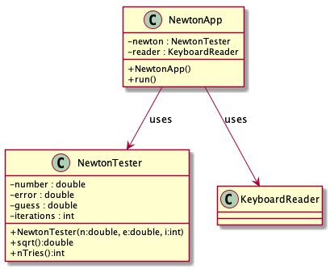
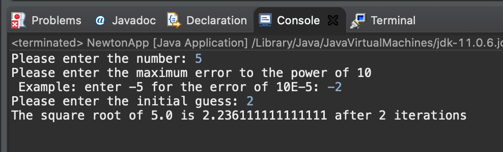
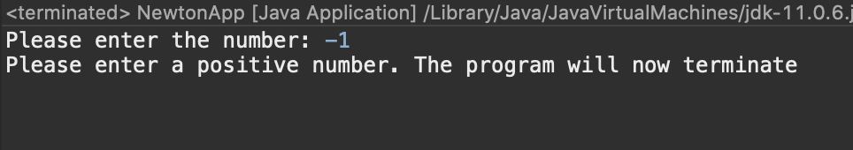
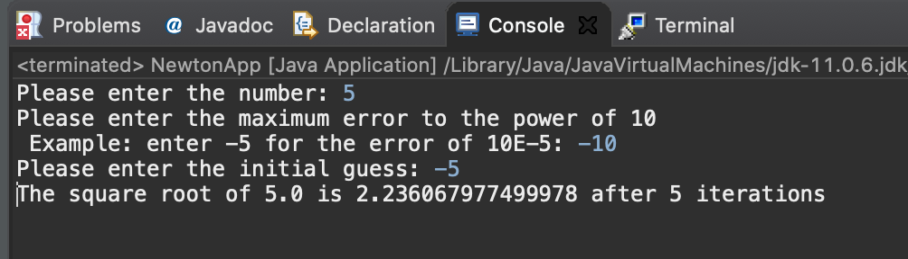

# Newton report
Author: Thien Nguyen

## UML class diagram
```
@startuml
skinparam classAttributeIconSize 0
class NewtonApp{
-newton : NewtonTester
-reader : KeyboardReader
+NewtonApp()
+run()
}
class NewtonTester{
-number : double
-error : double
-guess : double
-iterations : int
+NewtonTester(n:double, e:double, i:int)
+sqrt():double
+nTries():int
}
NewtonApp --> KeyboardReader : uses
NewtonApp --> NewtonTester : uses
@enduml
```


## Execution and Testing

###Test 1:
This test simulate the most common case when using the program. The user assumed to input the proper values.


###Test 2:
This test represent the case where the user tries to calculate the square root of a negative number. 


###Test 3:
This test simulate the case where the user enter a negative number for the initial guess. The program will automatically change the guess to positive and proceed to calculate the square root

