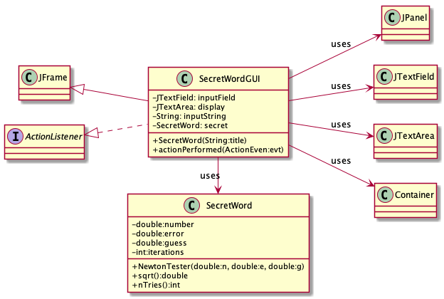
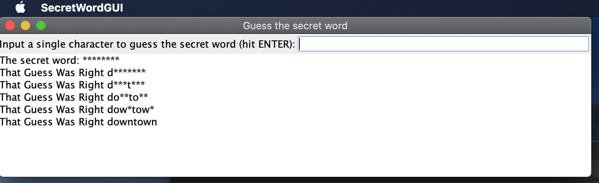

# SecretWord report
Author: Thien Nguyen

## UML class diagram
```
@startuml
left to right direction
skinparam classAttributeIconSize 0

class JFrame

class SecretWordGUI{
-JTextField: inputField
-JTextArea: display
-String: inputString
-SecretWord: secret
+SecretWord(String:title)
+actionPerformed(ActionEven:evt)
}

class SecretWord{
-double:number
-double:error
-double:guess
-int:iterations
+NewtonTester(double:n, double:e, double:g)
+sqrt():double
+nTries():int
}

interface ActionListener


class JPanel

class JTextField

class JTextArea

class Container

class SecretWordGUI extends JFrame
class SecretWordGUI implements ActionListener
SecretWordGUI -> SecretWord : uses
SecretWordGUI --> JTextArea : uses
SecretWordGUI --> JTextField : uses
SecretWordGUI --> Container : uses
SecretWordGUI --> JPanel : uses
@enduml
```



## Execution and Testing


